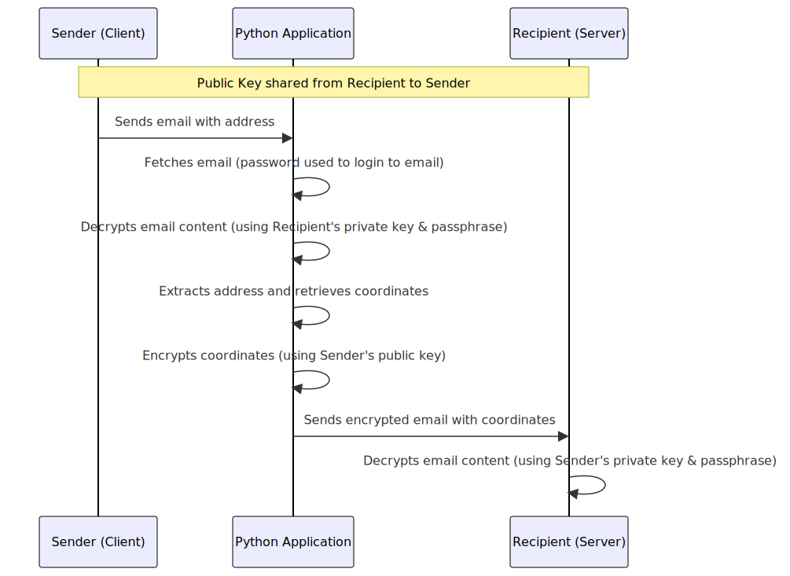

Dieses Repository enthält den Projektcode für ein praktisches Übungsprojekt, in dem wir diverse Techniken und Prozesse in der Softwareentwicklung anwenden. Das zentrale Ziel des Projekts war es, wichtige Aspekte der Softwareentwicklung zu veranschaulichen und anzuwenden, einschließlich der Arbeit mit APIs, Verschlüsselung, E-Mail-Kommunikation, Umgebungsvariablen und Versionskontrollsystemen.

Das Hauptmerkmal des Projekts ist eine Python-Anwendung, die geo-koordinatenbasierte Standortdaten abruft, diese Daten verschlüsselt und anschließend per E-Mail sendet. Die Anwendung sucht dann nach der gesendeten E-Mail, entschlüsselt die Nachricht und sendet die entschlüsselten Koordinaten zurück


# Python-Projekt: Adressumwandlung in Koordinaten und E-Mail-Versand
## Übersicht
In diesem Projekt bauen wir eine Applikation, die eine E-Mail mit einer Adresse empfängt, diese Adresse in Geokoordinaten umwandelt (unter Verwendung von Openrouteservice) und die Koordinaten in einer verschlüsselten E-Mail an den Absender zurücksendet.
- **E-Mail-Empfang:** Die Applikation verwendet imaplib und email Python built-in libraries, um die kürzlich empfangene E-Mail in einer spezifischen Mailbox zu extrahieren und den E-Mail-Inhalt zu dekodieren.
- **Adressumwandlung in Koordinaten:** Die Applikation sendet eine GET-Anfrage an die Openrouteservice Geocoding-API, um die Adresse in Längen- und Breitengradkoordinaten umzuwandeln.
- **Verschlüsselung der Koordinaten:** Die Applikation verschlüsselt die Koordinatendaten mit GNU Privacy Guard (GPG) unter Verwendung des öffentlichen Schlüssels des E-Mail-Absenders.
- **E-Mail-Versand:** Die Applikation verwendet smtplib und ssl Python built-in libraries, um eine verschlüsselte E-Mail mit den Koordinatendaten an den Absender zu senden.

## Installation

Die Applikation erfordert Python 3.12.0 und die folgenden Python-Pakete:
- certifi
- charset-normalizer
- idna
- pip
- python-dotenv
- requests
- urllib3

Die Pakete können mit pip installiert werden:
```shell
  pip install python-dotenv requests
```
Lege deinen eigenen .env-Datei im Basisverzeichnis des Projekts ab. Achte darauf, dass du die tatsächlichen Werte und nicht die Platzhalterwerte eingibst.


## Ausführung der Applikation
Um die Applikation zu starten, führe folgenden Befehl im Terminal aus:
```shell
  python main.py
```

Herzlichen Glückwunsch! Du hast nun das Projekt erfolgreich installiert und ausgeführt!

## Konfiguration Konstanten und Keys
Die Variablen und Schlüssel wie API-Keys in dem Python-Projekt dürfen nicht im Repo vorhanden sein. Dafür bestehen folgende 3 Lösungen.

### 1. Verwendung einer `.env`-Datei

Die `.env`-Datei ist eine einfache Textdatei, in der Umgebungsvariablen gespeichert werden. Sie wird oft im Wurzelverzeichnis des Projekts abgelegt.

- **Erstellen der `.env`-Datei**: Im Hauptverzeichnis deines Projekts erstellst du eine Datei namens `.env` und fügst deine Konfigurationsvariablen hinin:

  ```
  OPENROUTESERVICE_API_KEY=dein_API_Schlüssel
  SMTP_SERVER=smtp.beispiel.com
  SMTP_PORT=587
  ```

- **Laden der Variablen im Python-Code**: Um die Variablen aus der `.env`-Datei zu laden, verwendest du das `python-dotenv`-Paket:

  ```python
  from dotenv import load_dotenv
  import os

  load_dotenv()  # Lädt die Umgebungsvariablen aus der .env-Datei

  openrouteservice_api_key = os.environ.get('OPENROUTESERVICE_API_KEY')
  smtp_server = os.environ.get('SMTP_SERVER')
  smtp_port = int(os.environ.get('SMTP_PORT'))
  ```

### 2. Setzen der Variablen in der Kommandozeile

Du kannst Umgebungsvariablen direkt in deiner Kommandozeile (Terminal) setzen. Diese Methode ist temporär und gilt nur für die aktuelle Sitzung.

- **In Windows (CMD)**:

  ```cmd
  set OPENROUTESERVICE_API_KEY=dein_API_Schlüssel
  set SMTP_SERVER=smtp.beispiel.com
  set SMTP_PORT=587
  ```

- **In Unix/Linux/MacOS (Bash)**:

  ```bash
  export OPENROUTESERVICE_API_KEY=dein_API_Schlüssel
  export SMTP_SERVER=smtp.beispiel.com
  export SMTP_PORT=587
  ```

- **Zugriff im Python-Code**:

  ```python
  import os

  openrouteservice_api_key = os.environ.get('OPENROUTESERVICE_API_KEY')
  smtp_server = os.environ.get('SMTP_SERVER')
  smtp_port = int(os.environ.get('SMTP_PORT'))
  ```

### 3. Dauerhafte Speicherung in den System-Umgebungsvariablen

Du kannst Umgebungsvariablen auch dauerhaft auf deinem System speichern. Dies ist nützlich, wenn die Variablen systemweit und über Neustarts hinweg verfügbar sein sollen.

- **In Windows**:
  - Öffne die Systemeigenschaften (Rechtsklick auf "Dieser PC" > "Eigenschaften" > "Erweiterte Systemeinstellungen").
  - Klicke auf "Umgebungsvariablen" und füge neue Variablen unter "Benutzervariablen" oder "Systemvariablen" hinzu.

- **In Unix/Linux/MacOS**:
  - Füge die `export`-Befehle zu deiner `.bashrc`, `.zshrc` oder einem ähnlichen Konfigurationsfile deiner Shell hinzu.

- **Zugriff im Python-Code** bleibt gleich wie oben beschrieben.

### Sicherheitshinweise

- Speichere niemals sensible Daten wie Passwörter oder API-Schlüssel direkt im Quellcode.
- Die `.env`-Datei sollte nicht in Versionskontrollsystemen (wie Git) eingecheckt werden. Füge sie zu deiner `.gitignore`-Datei hinzu.
- Bei der dauerhaften Speicherung in System-Umgebungsvariablen ist darauf zu achten, dass diese Informationen möglicherweise für alle Anwendungen und Benutzer auf dem System zugänglich sind.

### Umsetzung der Konfiguration für Umgebungsvariablen

Unsere Anwendung verwendet eine `.env`-Datei, um sensible Daten wie den API-Schlüssel und E-Mail-Konfigurationsdaten sicher zu speichern. Wir platzieren die `.env`-Datei im Hauptverzeichnis des Projekts und fügen folgende Variablen hinzu:

```
OPENROUTESERVICE_API_KEY='Key'

SMTP_SERVER='smtp.gmail.com'
SMTP_PORT_TLS=587
SMTP_PORT_SSL=465

ACCOUNT_EMAIL='muster.max@gmail.com'
EMAIL_PASSWORD='DeinPasswort!'

IMAP_SERVER='smtp.gmail.com'
IMAP_PORT=993
```

Die `.env`-Datei wird dann dem gitignore hinzugefügt: 
```
/.env
```

## Installation weiterer Module
Um die Anwendung auszuführen, müssen einige externe Module installiert werden. Diese Module können mit pip, dem Paketmanager für Python, installiert werden. Führe die folgenden Befehle in deinem Terminal oder deiner Kommandozeile aus:
```bash
pip install requests
```
```bash
pip install python-dotenv
```

`requests` wird für HTTP-Anfragen an die Openrouteservice API verwendet, während `python-dotenv` benötigt wird, um Umgebungsvariablen aus der .env-Datei zu laden.

## Hauptfunktionen

### Geocoding mit Openrouteservice

Unsere Anwendung nutzt Openrouteservice, um Adressen in geografische Koordinaten umzuwandeln. Die Funktion `get_coordinates` sendet eine Anfrage an die Openrouteservice API und gibt die Koordinaten zurück.

### E-Mail-Verarbeitung

Wir lesen E-Mails über IMAP und extrahieren die Adressen aus dem E-Mail-Inhalt. Die E-Mail-Konfigurationsdaten werden aus der `.env`-Datei geladen.

### E-Mail-Versand

Nachdem wir die Adresse in Koordinaten umgewandelt haben, sendet unsere Anwendung eine Antwort-E-Mail mit den Koordinaten an den Absender. Die SMTP-Einstellungen werden ebenfalls aus der `.env`-Datei geladen.

## Sicherheitshinweise

- Wir laden die `.env`-Datei niemals in ein öffentliches Repository hoch und haben sie zu unserer `.gitignore`-Datei hinzugefügt.
- Wir verwenden starke, einzigartige Passwörter für unsere E-Mail-Konten und API-Schlüssel.
- Wir haben überlegt, ob für den E-Mail-Versand und das Lesen von E-Mails spezielle Konten eingerichtet werden sollten.

## Beispielcode

Hier ist ein Beispiel, wie wir die Umgebungsvariablen in unserem Code verwenden können:

  ```python
from dotenv import load_dotenv
import os

load_dotenv()  # Lädt die Umgebungsvariablen aus der .env-Datei

# Konfiguration
OPENROUTESERVICE_API_KEY = os.environ.get('OPENROUTESERVICE_API_KEY')
SMTP_SERVER = os.environ.get('SMTP_SERVER')
SMTP_PORT_TLS: int = int(os.environ.get('SMTP_PORT_TLS'))
SMTP_PORT_SSL: int = int(os.environ.get('SMTP_PORT_SSL'))
ACCOUNT_EMAIL = os.environ.get('ACCOUNT_EMAIL')
EMAIL_PASSWORD = os.environ.get('EMAIL_PASSWORD')
IMAP_SERVER = os.environ.get('IMAP_SERVER')
MAILBOX = os.environ.get('MAILBOX')
API_ENDPOINT = os.environ.get('API_ENDPOINT')
  ```

# Code-Struktur

Das Skript `main.py` beinhaltet die Hauptlogik unserer Anwendung und definiert folgende Schlüsselfunktionen und den Hauptausführungsblock der Anwendung:
- `get_latest_new_email()`: Diese Funktion nutzt IMAP, um den Inhalt der zuletzt erhaltenen unbekannten E-Mail zu extrahieren und zu dekodieren.
- `get_coordinates()`: Hier senden wir eine GET-Anfrage an die Openrouteservice Geocoding-API, um eine Adresse in Längen- und Breitengrade umzuwandeln.
- `encrypt_message()`: Diese Funktion verschlüsselt die erhaltenen Koordinateninformationen mit GnuPG, unter Verwendung des öffentlichen Schlüssels des E-Mail-Senders.
- `send_mail()`: Danach senden wir die verschlüsselte E-Mail mit den Koordinatendaten zurück an den Sender über SMTP.
- `decrypt_message()`: Schließlich nehmen wir die Antwort, entschlüsseln die Nachricht mit GnuPG unter Verwendung unseres privaten Schlüssels und extrahieren die darin enthaltenen Geokoordinaten.

Der Hauptausführungsblock der Anwendung stellt die Orchestrierung durch den Aufruf dieser Funktionen in logischer Reihenfolge sicher: 

Zunächst wandeln wir eine bekannte Adresse in Geokoordinaten um, verschlüsseln die Nachricht, senden die verschlüsselte Nachricht per E-Mail, erhalten die Antwort und entschlüsseln dann die empfangene Nachricht, um die Geokoordinaten zu lesen.

Jede der Funktionen in `main.py` ist für einen spezifischen Teil des Prozesses verantwortlich, wodurch der Code übersichtlich, modular und wartbar bleiben soll.

----

# Lerneffekte und Erkenntnisse
- Python bietet starke Bibliotheken für Netzwerk- und Sicherheitsaufgaben, die es uns ermöglichen, komplexe Anwendungen mit wenigen Zeilen Code zu erstellen.
- Die korrekte Behandlung von E-Mails mit Python kann anspruchsvoll sein, insbesondere wenn es darum geht, ungelesene Nachrichten korrekt zu managen.
- Der Umgang mit externen APIs kann Herausforderungen hinsichtlich ihrer Verfügbarkeit und ihren Anforderungen an die Anfragestruktur mit sich bringen.
- Wir lernten, dass es wichtig ist, sichere Praktiken während der Entwicklung zu beachten, um das Risiko von Datenlecks oder Sicherheitsverletzungen zu minimieren.

In diesem Projekt haben wir einen Prozess zum Abrufen, Verschlüsseln und Senden von geografischen Koordinaten per E-Mail implementiert. Hier teilt das Team seine Lernerfahrungen und den allgemeinen Prozess Weiter:

## Allgemeiner Prozess

Hauptfunktion `main`:

1. Generieren einer Adresse mit der `generate_existing_address`-Funktion, die eine zufällige, bereits existierende Adresse zurückgibt.

2. Mit der OpenRouteService API werden zu dieser Adresse Koordinaten ermittelt.

3. Die Koordinaten werden mittels GnuPG verschlüsselt und mittels Simple Mail Transfer Protocol (SMTP) per E-Mail versendet.

4. Wir warten 30 Sekunden und suchen dann nach der gerade versendeten E-Mail in unserer Mailbox mithilfe des Internet Message Access Protocol (IMAP).

5. Wir finden die E-Mail, entschlüsseln die in der E-Mail enthaltene Nachricht und senden die entschlüsselten Koordinaten zurück an den Absender.

## Weitere Learnings

1. **Umgang mit APIs:** Bei diesem Projekt war der Umgang mit der OpenRouteService API eine erkenntnisreiche Erfahrung. Wir haben gelernt, wie wir Standorte abrufen und in unserem Code implementieren können.

2. **Verschlüsselung:** Die Arbeit mit GnuPG zur Verschlüsselung der Daten war faszinierend. Wir haben gelernt, wie man Daten sicher verschlüsselt und entschlüsselt.

3. **E-Mail Automatisierung:** Das Projekt hat uns auch eine Vorstellung davon gegeben, wie wir E-Mails in Python automatisiert senden und empfangen können. Der Umgang mit SMTP und IMAP war aufschlussreich.

4. **Umgebungsvariablen:** Wir haben gelernt, wie wir Konfigurationsvariablen sicher speichern können. Dies war wichtig für die Sicherheit unserer API-Schlüssel und Passwörter.

Zusammenfassend hat uns dieses Projekt viele praktische Fähigkeiten vermittelt, die bei der Arbeit mit Ortsdaten, Verschlüsselung und E-Mail-Automatisierung nützlich sind. Wir freuen uns darauf, diese Fähigkeiten in zukünftigen Projekten weiter zuzunutzen.

Insgesamt war dieses Projekt eine gute Gelegenheit, um mehr über Netzwerkprogrammierung, Datenverschlüsselung und den Umgang mit REST-APIs in Python zu lernen.


## Google Email-Authentifizierungsproblem

Während wir an unserem Projekt arbeiteten, stießen wir auf ein interessantes Problem. Wir versuchten, ein Skript zu verwenden, um uns bei unserem Google-Konto anzumelden und E-Mails mit Python zu senden. Der Versuch, das zu tun, führte jedoch zu einem Fehler, den wir zuerst nicht verstehen konnten.

### Die Fehlermeldung
Die Fehlermeldung, die wir erhielten, war `(534, b'5.7.9 Application-specific password required)`. Wie sich herausstellte, bedeutet dieser Fehler, dass Google ein app-spezifisches Passwort verlangt, wenn eine Anwendung auf unser Google-Konto zugreifen will. Diese zusätzliche Sicherheitsmaßnahme dient dazu, unbefugten Zugriff auf unser Konto zu verhindern.

### Mögliche Lösung

#### App-spezifisches Passwort
Wir müssten ein app-spezifisches Passwort generieren, das wir in unserem Skript verwenden konnten. Das konnten wir [hier](https://myaccount.google.com/apppasswords) machen.

#### "Weniger sichere Apps"
Eine andere Option, die wir **nicht** empfehlen, wäre die Aktivierung der Option 'weniger sichere Apps'. Diese Option in unserem Google-Konto zuzulassen, würde bedeuten, dass unser Skript ohne diese zusätzliche Sicherheitsstufe läuft.

Wir möchten betonen, dass die Aktivierung dieser Option ein Sicherheitsrisiko darstellen kann, da sie das Sicherheitsniveau unseres Google-Kontos senkt.

Wir entschieden uns für die Nutzung der app-spezifischen Passwörter. Diese Option ist sicherer und dem Geist der 2-Schritte-Verifizierung treuer. Es war ein interessantes Problem, auf das wir stießen, und wir freuen uns, dass wir eine sichere Lösung dafür gefunden haben!
## PEP 8: W605 Fehlerbehebung

In unserem Python-Code hatten wir einen `PEP 8: W605 invalid escape sequence '\S'` Fehler auf Zeile 74.
  ```
python 74: server.store(latest, '+FLAGS', '\Seen')
 ```

Dieser Fehler tritt auf, weil `\S` in Python keine gültige Escape-Sequenz ist.

### Lösung PEP 8: W605 Fehlerbehebung:

Um diesen Fehler zu beheben, haben wir `\Seen` zu einem "Raw-String" in Python gemacht. Ein "Raw-String" in Python ignoriert Escape-Sequenzen und behandelt den Backslash (`\`) als normales Zeichen. Man erstellt einen "Raw-String" durch Voranstellen eines `r` vor den String.

Hier ist der korrigierte Code:
```
python 74: server.store(latest, '+FLAGS', r'\Seen')
```
Nach dieser Korrektur interpretiert Python den Backslash in `\Seen` buchstäblich und versucht nicht, eine Escape-Sequenz einzuleiten. Somit ist der `PEP 8: W605` Fehler behoben.


# Erklärung zur Public-Private Key Verschlüsselung

In diesem Mermaid-Diagramm wollen wir den Ablauf unserer E-Mail-basierten Koordinatenlösungsapplikation darstellen. Der Prozess beginnt, wenn der Absender (Client) uns eine verschlüsselte E-Mail mit einer Adresse schickt.

Vor diesem Schritt hat der Empfänger (Server) dem Sender (Client) den öffentlichen Schlüssel zur Verfügung gestellt, um die E-Mail zu verschlüsseln, die an unsere Anwendung gesendet wird. Dies sorgt dafür, dass die Daten während der Übertragung sicher und unverändert bleiben.

Als Python-Anwendung holen wir dann diese E-Mail ab. Dabei verwenden wir ein Passwort, um auf das E-Mail-Konto zuzugreifen. Sobald die E-Mail in unserer Anwendung ist, entschlüsseln wir den Inhalt unter Verwendung des privaten Schlüssels und der Passphrase des Empfängers. Dieser private Schlüssel befindet sich sicher auf dem Server und ist mit einer Passphrase geschützt.

Nach dem Entschlüsseln extrahieren wir die Adresse aus der E-Mail-Nachricht und verwenden die Openrouteservice-API, um die Koordinaten für diese Adresse zu ermitteln.

Die ermittelten Koordinaten verschlüsseln wir nun unter Verwendung des öffentlichen Schlüssels des Senders. Dies stellt sicher, dass die Antwort, die wir zurückschicken, nur vom Absender mit dessen privatem Schlüssel und Passphrase entschlüsselt werden kann.

Die verschlüsselte E-Mail mit den Koordinaten wird dann zurück an den Empfänger (also an das ursprüngliche Senderkonto) geschickt. Dort wird sie unter Verwendung des privaten Schlüssels des Senders und der Passphrase entschlüsselt.

Nach der Entschlüsselung enthält die E-Mail die Koordinaten für die ursprünglich in der ersten E-Mail angegebene Adresse. Auf diese Weise kann der ursprüngliche Absender dann mit den korrespondierenden Koordinaten der Adresse verfahren, wie es den Anforderungen entspricht.

Dieser gesamte Prozess stellt sicher, dass sowohl die Daten, die an unsere Anwendung gesendet werden, als auch die Daten, die wir zurücksenden, sicher gehandhabt und vor unerwünschten Zugriffen geschützt sind. Der öffentliche und private Schlüsselaustausch ermöglicht einen sicheren Datenfluss und die Passwortauthentifizierung gewährleistet die Überprüfung der Identität bei der Anmeldung bei den E-Mail-Konten.


